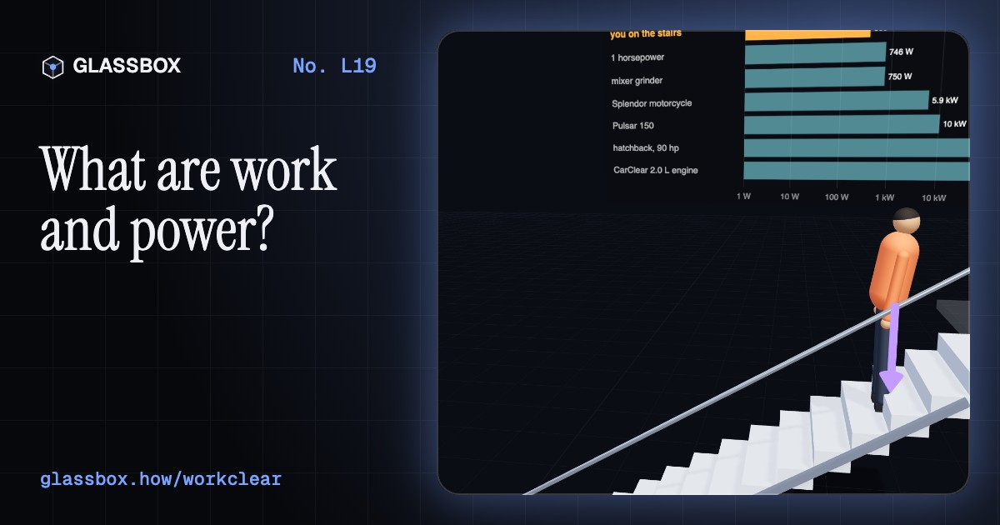
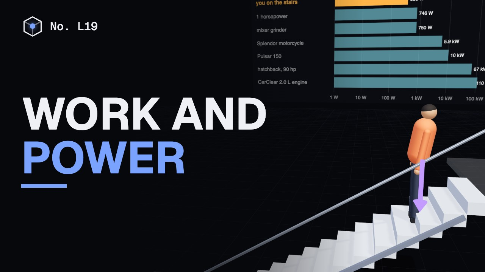
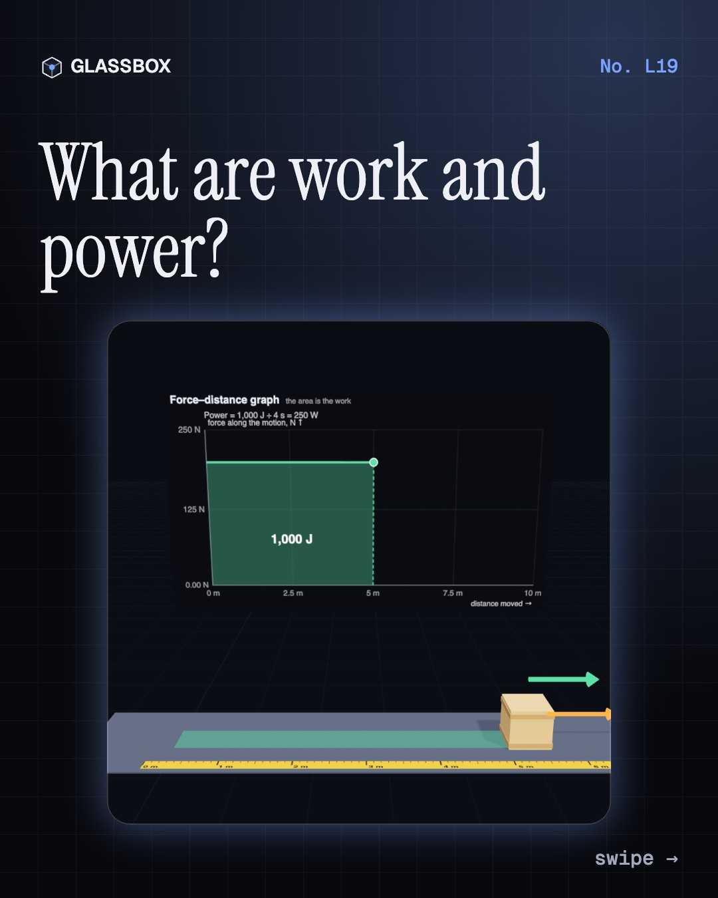
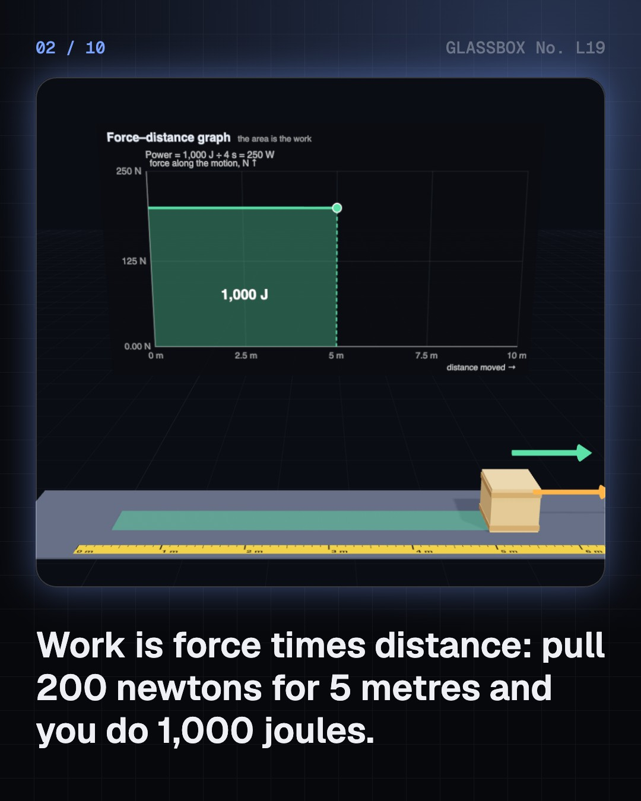
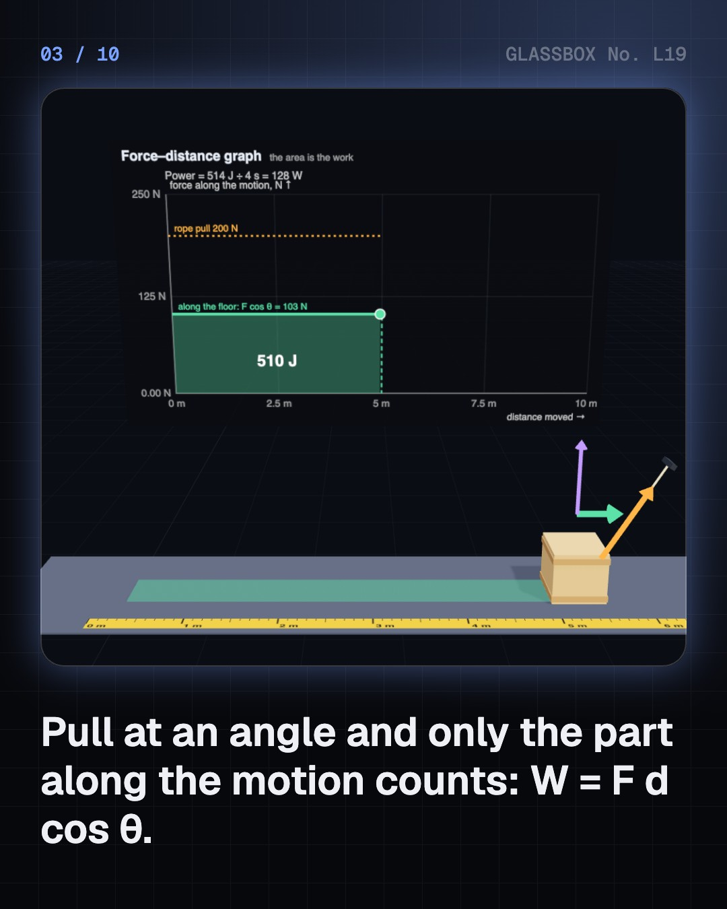
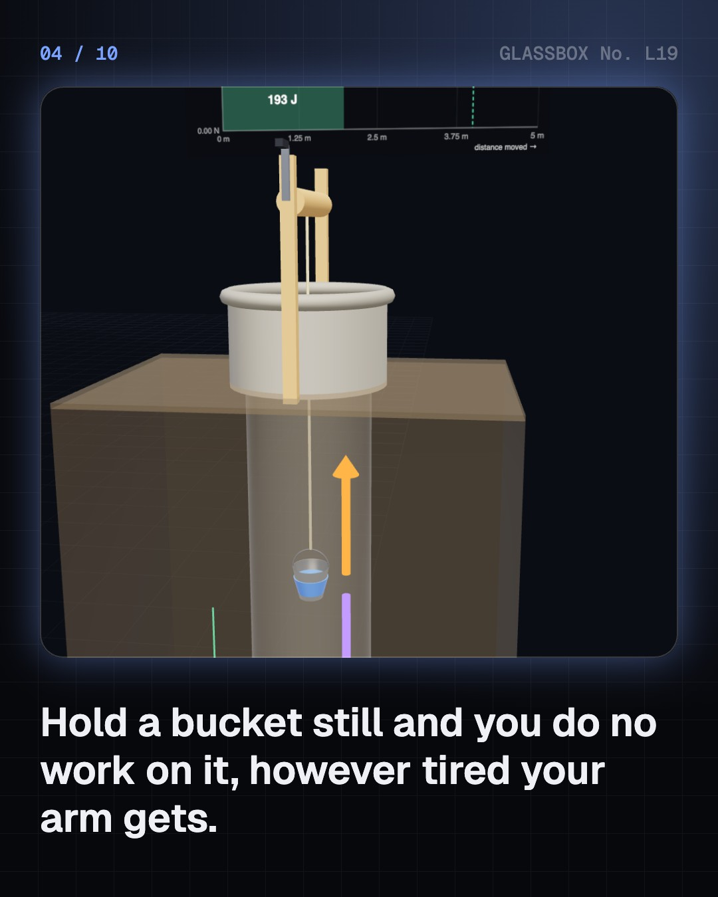

<!-- glassbox:start -->
<!-- Generated from glassbox.json by the Glassbox hub (npm run readme -- workclear). Edit glassbox.json, not this block. -->
<p align="center"><a href="https://glassbox.how/e/workclear/"></a></p>

<h1 align="center">Work and power</h1>

<p align="center"><b>What are work and power?</b><br>Pull a crate at an angle, wind a bucket up a well, and watch the joules pile up under a graph. Race up the stairs at 350 watts, meet Watt's horse, lift a rice sack with a lever, pulley and ramp, read your electricity bill in kilowatt-hours, and find out why holding still makes you tired but does no work.</p>

<p align="center"><a href="https://glassbox.how/workclear/"><b>▶ Play with it</b></a> &nbsp;·&nbsp; <a href="https://glassbox.how/e/workclear/">Read the 60-second explainer</a> &nbsp;·&nbsp; <a href="https://glassbox.how/workclear/glassbox/reel.mp4">Watch the 40-second video</a></p>

<p align="center">
  <a href="https://glassbox.how/e/workclear/"></a>
  <a href="https://glassbox.how/e/workclear/"></a>
  <a href="LICENSE"></a>
  <a href="LICENSE-CONTENT.md"></a>
  <a href="#privacy"></a>
</p>

## In 60 seconds

1. **Force times distance.** You do work when a force moves something along its direction: W = F × d, in joules. Pull at an angle and only F cos θ counts. On a force–distance graph, the work is the area under the line. If nothing moves, no work is done.
2. **Power is a rate.** Power is work ÷ time, in watts. Running up 3 m of stairs in 5 s, a 60 kg student makes about 350 W. A cyclist holds 100 to 250 W. Watt's mill horse did 33,000 foot-pounds a minute: 1 hp = 745.7 W.
3. **Machines trade force for distance.** Levers, pulleys, ramps and gears let a small force do a big job, but only by moving further. Work in = work out, minus friction. A bike chain is about 97% efficient; a petrol engine about 30%.
4. **Paying for work.** Electricity is sold by the kilowatt-hour: 1 kWh = 3.6 MJ. A 1.5 kW AC for 6 hours a day uses 270 units a month. Food is energy too: 2,000 kcal a day is 8.4 MJ, an average of about 97 W.
5. **Myths and limits.** Carrying a bag level does no work on it: the force is at 90° to the motion. More power doesn't mean more work, just faster work. Brakes do negative work. And holding still tires you because myosin heads keep burning ATP without moving anything.

## Words worth knowing

| Term | Meaning |
|---|---|
| **Work** | Energy handed over by a force that moves something: force × distance moved along the force. |
| **Joule (J)** | The unit of work and energy: a force of 1 newton acting over 1 metre. |
| **Power** | How fast work is done: work ÷ time, or force × speed. |
| **Watt (W)** | The unit of power: one joule every second. |
| **Horsepower (hp)** | James Watt's unit of power: 33,000 foot-pounds per minute, 745.7 W. |
| **Kilowatt-hour (kWh)** | 1,000 W for one hour: 3.6 MJ. One 'unit' on an electricity bill. |
| **Mechanical advantage** | How many times a machine multiplies your force. It always costs the same factor in distance. |
| **Efficiency** | Useful work out ÷ energy in. The rest is lost, mostly as heat. |

## A short history

**From Archimedes' lever to the star label on your AC: how people learned that force times distance is something you can measure, sell and pay for.**

- **250 BCE** · The law of the lever (Archimedes, Syracuse, Sicily)
- **1600** · You can't cheat nature (Galileo Galilei, Padua, Republic of Venice)
- **1782** · One horsepower (James Watt and Matthew Boulton, Birmingham, England)
- **1829** · Travail: work gets its name (Gaspard-Gustave Coriolis, Paris, France)
- **1845** · The paddle wheel (James Prescott Joule, Manchester, England)
- **1888** · A meter for AC (Oliver B. Shallenberger, Pittsburgh, USA)
- **2006** · India's star labels (Bureau of Energy Efficiency, New Delhi, India)

The full story, with 20 moments, charts, people and 29 sources: [glassbox.how/e/workclear/history](https://glassbox.how/e/workclear/history/). The data lives in [`history.json`](history.json).

## Video and slides

Made with the Glassbox studio from this box's storyboard (`window.glassbox.director`). Free to reuse under CC BY 4.0.

<a href="https://glassbox.how/workclear/glassbox/video.mp4"></a>

<p><a href="glassbox/slide-1.jpg"></a> <a href="glassbox/slide-2.jpg"></a> <a href="glassbox/slide-3.jpg"></a> <a href="glassbox/slide-4.jpg"></a></p>

| File | What | Size |
|---|---|---|
| [`glassbox/reel.mp4`](https://glassbox.how/workclear/glassbox/reel.mp4) | Reel / Short, with captions and soundtrack | 1080×1920 |
| [`glassbox/video.mp4`](https://glassbox.how/workclear/glassbox/video.mp4) | YouTube video, with captions and soundtrack | 1920×1080 |
| `glassbox/slide-1…10.jpg` | Instagram carousel | 1080×1350 |
| `glassbox/thumb.jpg` | YouTube thumbnail | 1280×720 |
| `glassbox/cover.jpg` | Share card and repo social preview | 1200×630 |
| [`glassbox/history-reel.mp4`](https://glassbox.how/workclear/glassbox/history-reel.mp4) | “History in 10 moments” Reel / Short | 1080×1920 |
| `glassbox/history-slide-*.jpg` | History carousel | 1080×1350 |
| `glassbox/post.json` | Post copy and schedule used by the publish kit | |

## Privacy

This box has no accounts and no ads, and it ships its own fonts and libraries. When you run it yourself it sends nothing anywhere. On glassbox.how, the site's `/bar.js` also loads Glassbox's analytics: **Google Analytics** to count visits (it asks first in the EU, UK and Switzerland, and stays off when your browser sends Global Privacy Control or Do Not Track) and **ClickTrust** to detect bots.

It remembers a few things **in your own browser only**, and never sends them anywhere:

| Browser storage key | What it holds |
|---|---|
| `workclear.v1` | Which chapters you have opened, your best quiz scores, and sound on or off. |

Exactly what each one sees is at [glassbox.how/privacy](https://glassbox.how/privacy/).

## Licences

- **Code:** [MIT](LICENSE). Use it, change it, ship it.
- **Explanations, text, images and videos** (`glassbox.json`, `glassbox/`): [CC BY 4.0](LICENSE-CONTENT.md). Credit “Glassbox, glassbox.how/e/workclear”.
- **Third-party parts** keep their own licences: [three.js](https://threejs.org) (MIT), [Geist, Instrument Serif](https://openfontlicense.org) (SIL OFL 1.1).
- The Glassbox name and logo aren't covered by either licence. See the [terms](https://glassbox.how/terms/).

Found a mistake? [Open an issue](https://github.com/bdeeps/workclear/issues). Corrections happen in public.
<!-- glassbox:end -->

## Run it

It's plain HTML, CSS and JavaScript. No build step and no dependencies. Run locally, it contacts no other website.

```bash
python3 -m http.server 8000
```

Three.js and the fonts ship in `vendor/` and `fonts/`, so it also works offline.

Then open http://localhost:8000.

## How it's built

| File | What |
|---|---|
| `index.html`, `css/app.css` | The page and its styles |
| `js/app.js`, `js/stage.js`, `js/ui.js`, `js/kit.js` | The shared Glassbox 3D engine: chapters, 3D stage, controls, quiz, video director |
| `js/chapters/*.js` | One file per chapter: the 3D model, controls, text, key terms, quiz and video scenes |
| `js/work.js` | Shared WorkClear parts: joule, watt and rupee formatting, power comparison data, chart boards, force arrows, a looping job timer, and the person, car, bucket, rice sack and horse models |
| `glassbox.json` | Title, question, explainer beats, key terms, browser storage and credits shown on glassbox.how |
| `reel` in each chapter | The storyboard the Glassbox studio records into short videos |
| `glassbox/` | The published video, slides, thumbnail and post copy |
| `fonts/`, `vendor/three/` | Self-hosted Geist and Instrument Serif (SIL OFL 1.1) and three.js (MIT) |
